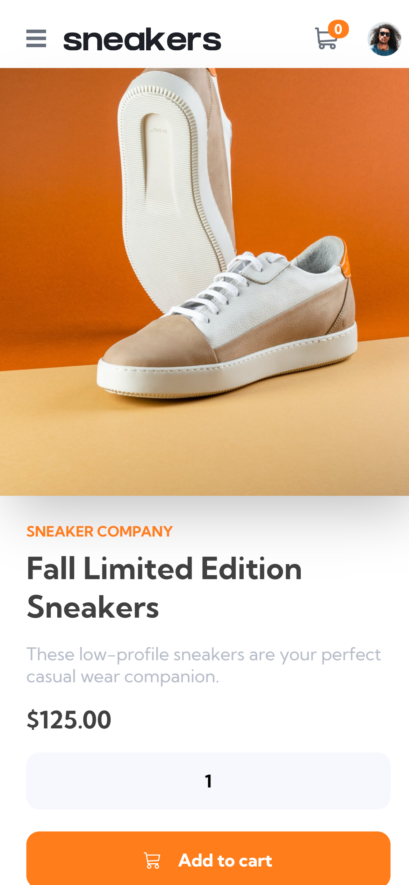
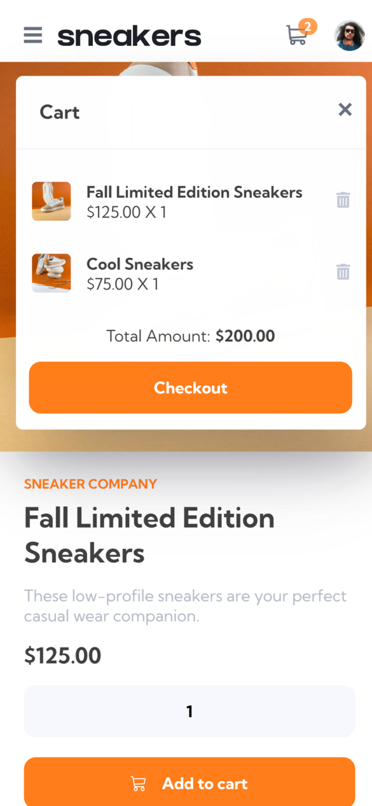

# Overview
The objective of this project is to implement a shopping cart functionality using React Context API. 
## Features
- Mobile responsive
- Add and remove items to the cart 
- View, update, close the cart modal
- Show active states of the cart 
- Display the number of items in a cart on a badge
## Demo
[Live Demo](https://regal-faun-bcff09.netlify.app)
### Desktop version

### Mobile version

# Skills used
- React
    - Context API
- Styled Components
    - CSS animation
    - Global style
# Lessons Learned
- React
    - Importing svgs to React
    - Using react-responsive for media query
- Adding a modal via React Portal
- Styled Components
    - Using attribute to style input number spinner
    - Conditionally adding CSS classnames to styled components 
# Acknowledgements
- [Style guide](https://www.frontendmentor.io/challenges/ecommerce-product-page-UPsZ9MJp6)
